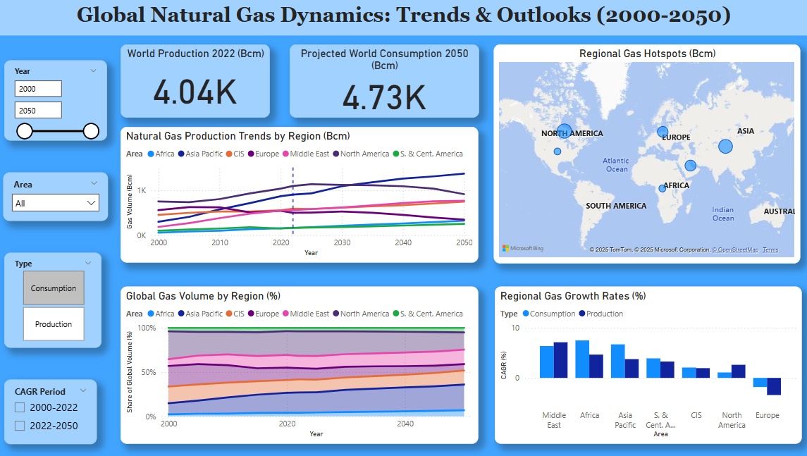

# Global Natural Gas Dynamics: Trends & Outlooks (2000-2050)

## Objective
This project analyzes historical (2000-2022) and projected future (2023-2050) trends in natural gas production and consumption across key global regions and economic blocs. The goal is to identify major shifts in regional gas markets, compare growth trajectories, and explore potential future scenarios using an interactive Power BI dashboard.

## Data Source
*   **Primary Data:** BP Energy Outlook 2024 - Summary Tables (specifically the sheets for "Natural gas Production - Bcm" and "Gas - Bcm").
    *   *Note: The `bp-energy-outlook-2024-summary-tables.xlsx` file used in this project can typically be found on the official BP (or Energy Institute) website for their Energy Outlook publications.*
*   **Years Analyzed:** 2000-2050 (including historical data and "Current Trajectory" projections).

## Tools Used
*   **Python 3.x**
    *   **Pandas:** For data extraction, cleaning, transformation, and calculating growth rates.
    *   **Matplotlib & Seaborn:** For initial static data visualizations.
*   **Microsoft Power BI Desktop:** For creating an interactive dashboard with dynamic charts, maps, and slicers.
*   **Git & GitHub:** For version control and project sharing.

## Key Analyses Performed
*   Extraction and processing of natural gas production and consumption data by region, key countries, and global aggregates.
*   Calculation of historical (2000-2022) and projected (2022-2050) Compound Annual Growth Rates (CAGR).
*   Visualization of long-term trends for production and consumption volumes.
*   Comparison of regional shares in global gas volumes.
*   Geographic representation of gas volumes using map visuals.

## How to Run/Use the Project

1.  **Prerequisites:**
    *   Python 3.8+
    *   Pandas, Matplotlib, Seaborn, openpyxl (`pip install pandas matplotlib seaborn openpyxl`)
    *   Microsoft Power BI Desktop

2.  **Python Script (`global_gas_outlook_analysis.ipynb` or `.py`):**
    *   Ensure the `bp-energy-outlook-2024-summary-tables.xlsx` file is available.
    *   Update the `DATA_FILE_PATH` variable in the script to point to the correct location of the Excel file if it's not in the same directory.
    *   Run the Python script. This will process the data and generate two CSV files:
        *   `natural_gas_outlook_data_for_powerbi.csv`
        *   `natural_gas_outlook_cagr_for_powerbi.csv`
    *   It will also generate and save several `.png` plot images.

3.  **Power BI Dashboard (`Global_Gas_Outlook.pbix`):**
    *   Open the `Global_Gas_Outlook.pbix` file with Power BI Desktop.
    *   The dashboard is designed to connect to the CSV files generated by the Python script. If the PBIX file and CSV files are in the same folder, the data sources should connect automatically.
    *   If data sources are broken, go to File -> Options and settings -> Data source settings, then select the CSV sources and "Change Source..." to point them to the correct file paths.
    *   Interact with the slicers for Year, Area, Type, and CAGR_Period to explore the data.

## Summary of Findings & Insights (Example - tailor this to your actual findings)
*   The Asia Pacific region, driven by China and India, shows significant projected growth in natural gas consumption through 2050.
*   North America (led by the US) and CIS (led by Russia) remain dominant producers, with varying future outlooks.
*   The Middle East is projected to see strong growth in both production and consumption.
*   Developed economies show more modest growth or even declines in consumption in later projection years, particularly in "Net Zero" type scenarios (if analyzed).
*   

## Dashboard Preview

